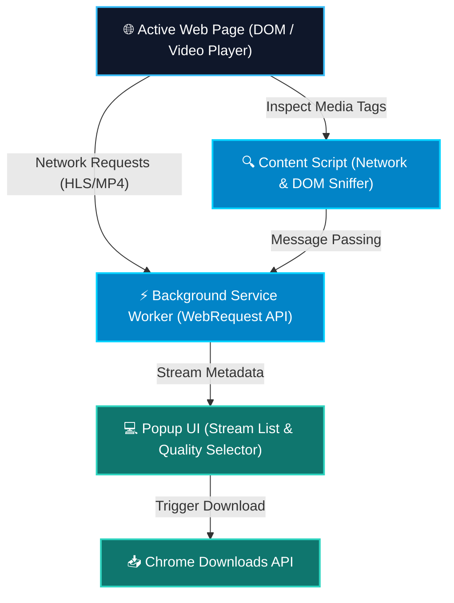

<div align="center">


<p align="center">
  <b>High-Performance · Manifest V3 · Zero Watermarks · Unlimited Downloads · 100% Client-Side</b>
</p>

<p align="center">
  
  
  
  
</p>

[فارسی](#-راهنمای-فارسی) • [English](#-english-overview) • [Installation](#-quick-installation-1-minute) • [Features](#-key-features) • [Architecture](#-technical-architecture)

</div>

---

## ⚡ Key Features

* 🎯 **Universal Video Stream Sniffer**: Automatically detects and extracts hidden video streams (**MP4, WebM, M3U8 / HLS, TS chunks, FLV**) across web pages.
* 🚀 **Zero Watermark & Full Quality**: Downloads original raw source files directly without re-compression or quality loss.
* 🔒 **100% Private & Client-Side**: No external proxy or third-party servers; all network inspection is done strictly within your browser.
* 🧩 **Modern Manifest V3 Architecture**: Fully compliant with modern Chrome Web Store policies using asynchronous service workers.
* 📦 **One-Click Batch Downloader**: Download individual video streams or grab all media assets on the active page with a single click.

---

## 🚀 Quick Installation (1 Minute)

1. **Clone or Download** this repository:
   ```bash
   git clone https://github.com/mrzroot/universal-video-downloader.git
   ```
2. Open your browser and navigate to:
   - **Google Chrome**: `chrome://extensions`
   - **Microsoft Edge**: `edge://extensions`
   - **Brave Browser**: `brave://extensions`
3. Toggle **Developer mode** (حالت توسعه‌دهنده) in the top-right corner.
4. Click **Load unpacked** (بارگذاری بسته بازنشده) and select the cloned `universal-video-downloader` folder (the one that contains `manifest.json`).
5. Pin the extension and open any video page to start downloading!

---

## 📐 Technical Architecture



---

## 🇮🇷 راهنمای فارسی

افزونه **Super Video Downloader** یک افزونه حرفه‌ای برای مرورگرهای مبتنی بر کرومیوم (Chrome, Edge, Brave) است که به شما امکان می‌دهد انواع ویدیوها و پخش‌های زنده اینترنتی (شامل پلتفرم‌های آموزشی، دوره‌ها و سایت‌های ویدیویی) را با حداکثر کیفیت و بدون محدودیت دانلود کنید.

### 🌟 ویژگی‌های کلیدی
* **شناسایی خودکار جریان‌های ویدیویی**: کشف لینک‌های پنهان `m3u8`، `MP4` و `WebM` در پس‌زمینه.
* **بدون واترمارک و رایگان**: دانلود فایل‌های اصلی با حداکثر بیت‌ریت منبع.
* **امنیت کامل**: پردازش داده‌ها ۱۰۰٪ داخل مرورگر شما انجام شده و هیچ داده‌ای به سرور خارجی ارسال نمی‌شود.

### 📥 مراحل نصب سریع (کمتر از ۱ دقیقه)
1. پوشه افزونه را دانلود یا کلون کنید.
2. در مرورگر کروم یا اج وارد صفحه `chrome://extensions` شوید.
3. در گوشه بالا سمت راست، گزینه **Developer mode** را فعال کنید.
4. روی دکمه **Load unpacked** کلیک کرده و پوشه این پروژه را انتخاب کنید.
5. آیکون افزونه را پین کرده و در هر صفحه‌ای که ویدیو دارد روی آن کلیک کنید تا لیست لینک‌های دانلود نمایش داده شود.

---

## 👨‍💻 Author & Maintainer

Engineered by **M-R-Z** ([@mrzroot](https://github.com/mrzroot))  
Feel free to open Issues, PRs, or star ⭐ this repository if it helped you!

---

<div align="center">
  <sub>Licensed under the <a href="LICENSE"><b>MIT License</b></a> · Built with modern JavaScript & Chrome Extension MV3</sub>
</div>
